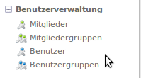

# Initialisierung

Hier erhalten Sie Informationen über die Initialisierung.

**Seiteninhalt**
<!-- toc -->
1. [Mitglieder und Mitgliedergruppen anlegen](#mitglieder-und-mitgliederdruppen-anlegen)
2. [Dateityp-Sets erstellen](#dateityp-sets-erstellen)

## Mitglieder und Mitgliedergruppen anlegen

Bevor man mit dem eigentlichen Aufbau der Dokumentenablage beginnt (also Kategorien anlegt, Zugriffsrechte zuordnet usw.), sollten sie im Vorfeld über die Benutzerverwaltung von Contao Mitglieder und Mitgliedergruppen anlegen

Dies kann zwar auch zu einem späteren Zeitpunkt erfolgen. Allerdings macht das Vorhandensein von Mitgliedergruppen spätestens beim Anlegen der Kategorien die Arbeitsschritte effizienter. 

