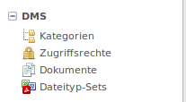

# Installation

Hier erhalten sie Informationen über die Installation.

**Inhalt**
<!-- toc -->

## Installation per Erweiterungskatalog

Die Erweiterung [DokManSystem] kann in der Contao Erweiterungsverwaltung im Backend installiert werden.

→ System → Erweiterungsverwaltung → Erweiterung installieren → Eingabe: DokManSystem

**Für die manuelle Installation**, können die benötigten Dateien hier heruntergeladen werden: https://github.com/ContaoDMS

Anschließend steht dem Administrator das Modul "DMS" mit den Werkzeugen: 

* Kategorien
* Zugriffsrechte
* Dokumente 
* (und Dateityp-Sets) *ist ein extra Add-On, muss separat installiert werden*
 
zur Verfügung.

## Installation per Composer

Für die Installation per Composer sind alle Pakete unter https://packagist.org/packages/contao-dms/ zu finden. Für die Suche im Contao Backend reicht es `contao-dms/` einzugeben. Dann werden alle zur Verfügung stehen Pakte angezeigt.
Das Paket https://packagist.org/packages/contao-dms/bundle-all enthält das ContaoDMS sowie auch das Dateityp-Sets Add-On.

## Serverkonfiguration

Unter Umständen muss man eine eigene `php.ini` ins Web-ROOT der Installation legen um z.B. Arbeitsspeicher Limits oder Ausführungszeiten zu definieren. Sind diese zur gering kann es vorkommen, dass größere Dateien nicht hochgeladen werden können.

Ein Beispiel für den Inhalt einer solchen `php.ini` Datei sieht wie folgt aus:

    # increase memory limits and execution time
    upload_max_filesize = 5M
    memory_limit = 512M
    max_execution_time = 50000
    post_max_size = 40M

## Installation per Contao-Manager

1. Contao-Manager aufrufen (z.B. meine-Domain.de/contao-manager.phar.php)
2. Login Contao-Manager 
3. nach Durchlauf der Systemüberprüfung weiter zum **Contao-Manager**
4. In der Suche nach **Contao DMS** suchen
5. Es werden alle zur Verfügung stehenden Pakete angezeigt.
6. Das Paket **ContaoDMS Bundle all** enthält das ContaoDMS sowie auch das Dateityp-Sets Add-On.
7. mit **Hinzufügen** das Paket zur Installation bereitstellen
8. anschließend auf **Pakete**
9. nun auf **Änderungen anwenden**
10. Pakete werden aktualisert
11. weiter zu **Datenbank aktualisieren**
12. Weiterleitung zum Contao Intalltool
13. Login
14. hier Datenbank aktualisieren
15. anschließend zum Backend (Login)
16. Im Backend sind nun die ContaoDMS Werkzeuge zu sehen
