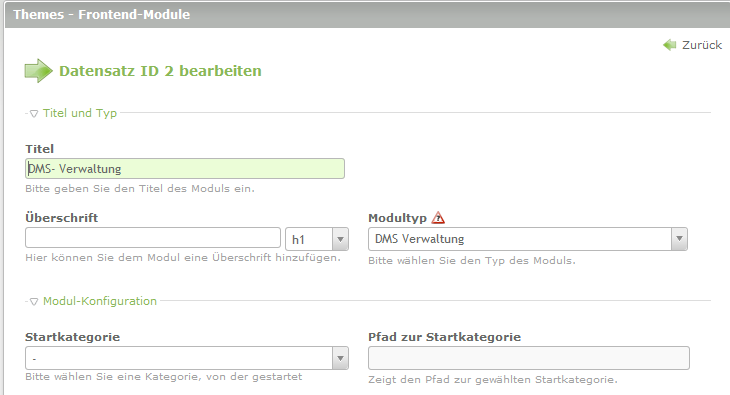
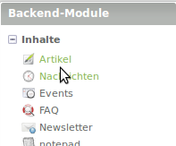
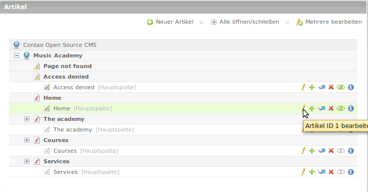
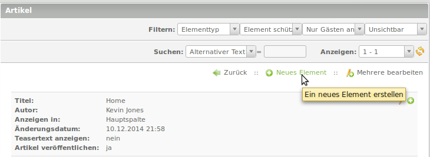
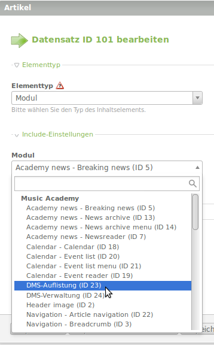

# Module

Hier erhalten Sie Informationen über die Frontend-Module.

**Seiteninhalt:**

1. [Anlegen der Frontend-Module](modules/README.md#anlegen-der-frontend-module)
2. [Modul ContaoDMS Auflistung](modules/README.md#dms-auflistung)

## Anlegen der Frontend-Module

Es müssen zwei neue Frontend-Module erzeugt werden.

1. Eines für die **Auflistung**
2. Eines für die **Verwaltung**

Unter **Layout** → **Themes** → Frontend-Module.

### DMS-Auflistung
* **Titel des Moduls:** DMS-Auflistung 
* **Modultyp:** DMS-Auflistung
* **DMS-Template:** mod_dms_listing

### DMS-Verwaltung
* **Titel des Moduls:** DMS-Verwaltung 
* **Modultyp:** DMS-Verwaltung 
* **DMS-Template:** mod_dms_management

## Einbindung der Module in die Website

  * Die Module können als Inhaltselemente an beliebiger Stelle der Website eingebunden werden. 
  * Nachfolgend ist die Einbindung des Frontendmoduls **DMS-Auflistung** beschrieben. 
  * Das Modul **DMS-Verwaltung** wird auf die gleiche Weise eingebunden.

→ Inhalte → Artikel 

 → Artikel auswählen 
 
 

→ Neues Element

→ Element an gewünschte Stelle mittels Einfügesymbol einfügen

→ Auswahl des Elementtyps → *Modul* 

→ Auswahl des Moduls (hier das Modul "DMS-Auflistung")

