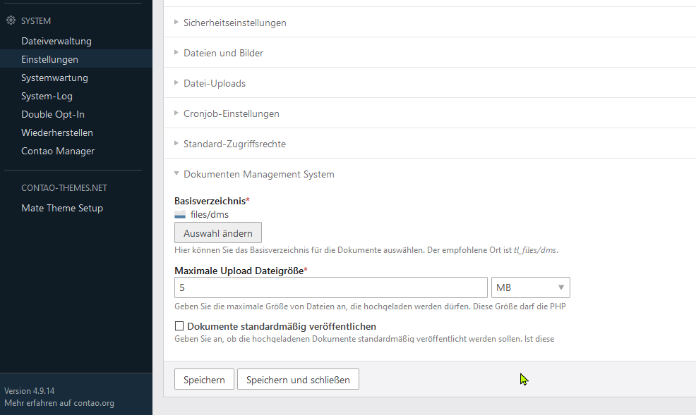
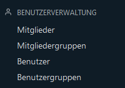

# Grundeinstellungen

## Allgemeine Grundeinstellungen

Nach der Installation der ContaoDMS Pakets finden sie in der Contao **Systemverwaltung** → unter **Einstellungen** im Abschnitt *Dokumenten Management System* die Grundeinstellungen für das ContaoDMS.

### Hier können folgende Anpassungen vorgenommen werden:

#### Basisverzeichnis

**Wo sollen die Dokumente abgelegt werden?**  
Voreinstellung und empfohlen ist (Contao 3.x und 4.x): `files/dms`

#### Maximale Upload Größe: 

**Wie groß dürfen die Dateien sein die hochgeladen werden?**  
Diese Größe darf die PHP Einstellung für upload_max_filesize **nicht** überschreiten.

#### Dokumente standardmäßig veröffentlichen:

Ist diese Option aktiviert wird die Checkbox zum Veröffentlichen im Verwaltungsmodul (Frontend) immer angekreuzt.

## Mitgliedergruppen und Mitglieder anlegen

Bevor der eigentliche Aufbau der Dokumentenablage beginnt (also Kategorien anlegt, Zugriffsrechte zuordnet werden usw.), sollten sie im Vorfeld über die Benutzerverwaltung von Contao Mitglieder und Mitgliedergruppen anlegen

Dies kann auch zu einem späteren Zeitpunkt erfolgen. Allerdings macht das Vorhandensein von Mitgliedergruppen spätestens beim Anlegen von Kategorien die Arbeitsschritte effizienter. 

