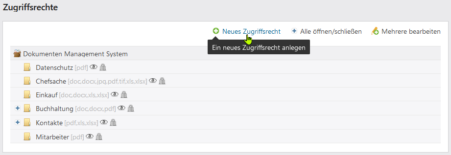
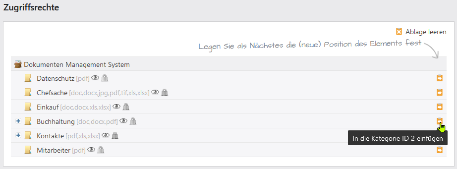
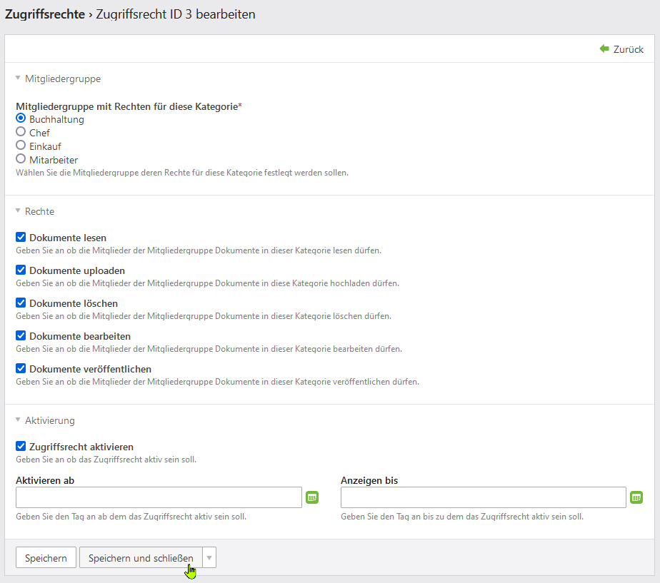
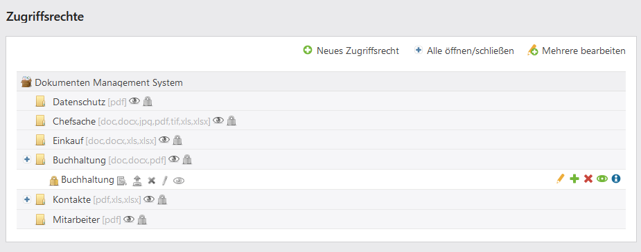

# Zugriffsrechte

* Mit dem Werkzeug **Zugriffsrechte** stellen Sie Zugriffsberechtigungen für Mitgliedergruppen und / oder Mitglieder ein
* Mitgliedergruppen und Mitglieder legen Sie in der Contao Benutzerverwaltung an

## Neues Zugriffsrecht erstellen

Exemplarisch wird nachfolgend ein Zugriffsrecht für Kategorie **Buchhaltung** erstellt. Die Mitgliedergruppe **Buchhaltung** erhält den vollen Zugriff. D.h. Mitglieder der Gruppe dürfen Dokumente lesen, Dokumente uploaden, Dokumente löschen, Dokumente bearbeiten und veröffentlichen.

* Klicken Sie auf **Neues Zugriffsrecht**:

* Wählen Sie die Kategorie aus für das Sie das Zugriffsrecht definieren möchten:

* Wählen Sie die Mitgliedergruppe deren Rechte für diese Kategorie festgelegt werden soll
* Setzen Sie im nächten Abschnitt **Rechte** die gewünschten Rechte
* Geben Sie an ob das Zugriffsrecht aktiv sein soll
* Sie können die Zugriffsrechte ab einen bestimmten Tag aktivieren und und enden lassen (deaktivieren)
* Speichern Sie ihre Einstellungen

## Mögliche Zugriffsrechte

* **Dokumente lesen:** Geben Sie an ob die Mitglieder der Mitgliedergruppe Dokumente in dieser Kategorie lesen dürfen.  
   
* **Achtung!** Möchten sie, dass Mitglieder Dokumente einer Kategorie NICHT lesen sollen, muss für diese Kategorie im Abschnitt [Grundsätzliche Lese-, und Verwaltungsrechte](categories.md/#grundsätzliche-lese-und-verwaltungsrechte) unter **Grundsätzliches Leserecht** "*Spezielle Leserechte für einzelne Mitgliedergruppen*" gesetzt sein.

* **Dokumente uploaden:** Geben Sie an ob die Mitglieder der Mitgliedergruppe Dokumente in diese Kategorie hochladen dürfen.
* **Dokumente löschen:** Geben Sie an ob die Mitglieder der Mitgliedergruppe Dokumente in dieser Kategorie löschen dürfen.
* **Dokumente bearbeiten:** Geben Sie an ob die Mitglieder der Mitgliedergruppe Dokumente in dieser Kategorie bearbeiten dürfen.
* **Dokumente veröffentlichen:** Geben Sie an ob die Mitglieder der Mitgliedergruppe Dokumente in dieser Kategorie veröffentlichen dürfen.

**Aktivierung:** Setzen Sie das Zugriffsrecht auf *aktiv* (direkt aktiviert) oder *inaktiv* (kein Häkchen)

## Ansicht der Zugriffsrechte im Backend

Im Backend stellt sich nun die Ansicht der Zugriffsrechte wie folgt dar:

