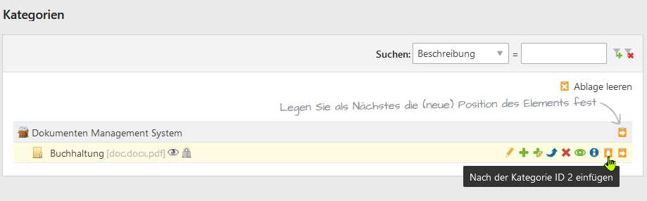
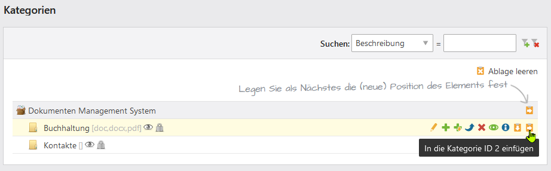
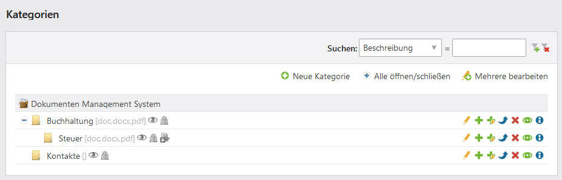
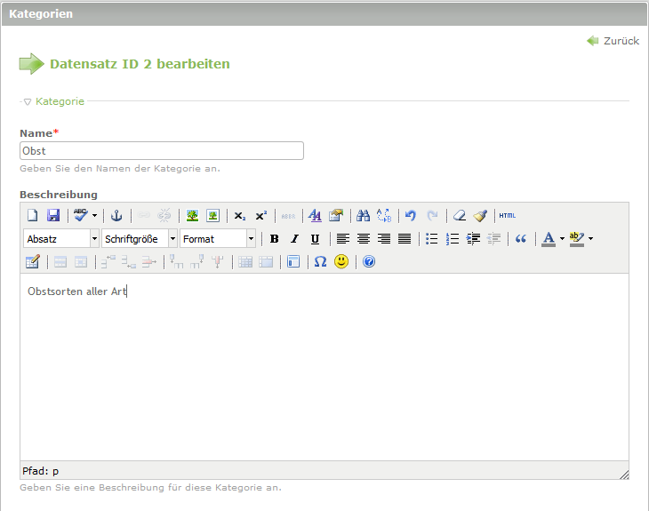
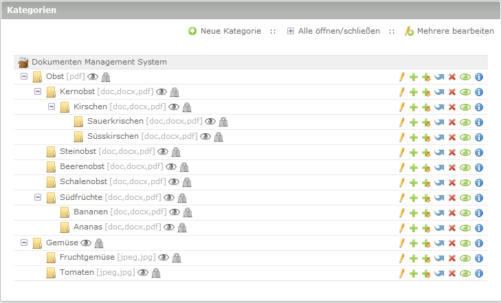
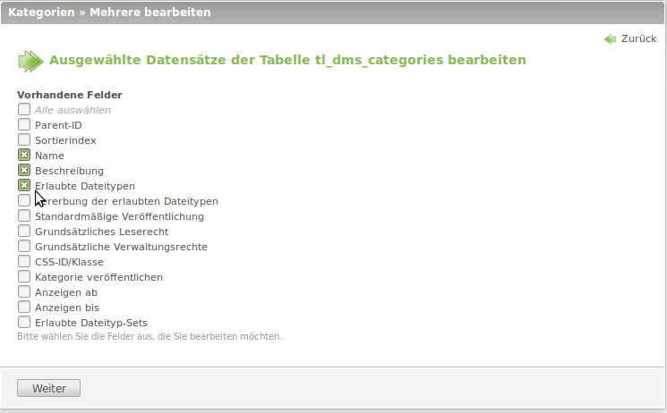
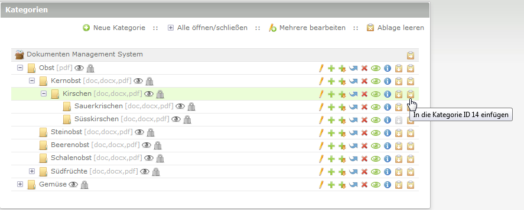

# Kategorien

**Seiteninhalt**

1. [Kategorien im ContaoDMS](#kategorien-im-contaodms)
2. [Kategorietiefe](#kategorietiefe)
3. [Kategoriebilder](#kategoriebilder)
4. [Anlegen einer neuen Kategorie](#anlegen-einer-neuen-kategorie)
5. [Kategorieeinstellungen](#kategorieeinstellungen)
6. [Erlaubte Dateitypen](#erlaubte-dateitypen)
7. [Vererbung von erlaubten Dateitypen](#vererbung-von-erlaubten-dateitypen)
8. [Veröffentlichung von Dokumenten](#veröffentlichung-von-dokumenten)
9. [Grundsätzliche Lese und Verwaltungsrechte](#grundsätzliche-lese-und-verwaltungsrechte)
10. [Bearbeitung einer Kategorie](#bearbeitung-einer-kategorie)
11. [Mehrere Datensätze bearbeiten](#mehrere-datensätze-bearbeiten)
12. [Verschieben einer Kategorie](#verschieben-einer-kategorie)
13. [Löschen einer Kategorie](#löschen-einer-kategorie)

## Kategorien im ContaoDMS

* Kategorien sind die Orte in welchen die Dokumente später aufbewahrt werden.
* Jedes Dokument wird genau einer Kategorie zugeordnet. Daher ist es wichtig, sich im Vorfeld eine sinnvolle Struktur zu überlegen.
* Eine weitere wichtige Überlegung sollte sein, welche Dokumente die einzelnen Mitglieder später zu sehen bekommen sollen.
* Grundsätzlich ist zu entscheiden ob Dokumente von allen Nutzern der Website (auch nicht angemeldeten), nur von angemeldeten Mitgliedern, oder nur von Mitgliedern spezieller Mitgliedsgruppen gelesen werden dürfen.
* Es besteht also ein Zusammenspiel von **Kategorien** und **Zugriffsrechten**
* Jede Kategorie benötigt einen aussagefähigen **Namen** und eine möglichst ausführliche aber nicht zu lange **Beschreibung**
* Der Name und die Beschreibung werden später im Frontend angezeigt

## Kategorietiefe

Es ist maximal ein 4-stufiger Kategorieaufbau zulässig. Das sollte eigentlich für jeden Anwendungszweck ausreichen.

<pre>
  Hauptkategorie
   --> 1. Unterkategorie
    ---> 2. Unterkategorie
     ----> 3. Unterkategorie
      -----> 4. Unterkategorie
</pre>

## Kategoriebilder

* Jeder Kategorie kann genau ein Bild zugewiesen werden (z.B. als Vorschaubild)
* Diese Bild muss in der Contao-Dateiverwaltung hochgeladen werden

## Anlegen einer neuen Kategorie

Im Modul DMS → Kategorien

→ "Neue Kategorie“ anlegen

→ Kategorie mittels Einfügesysmbol an gewünschte Stelle einfügen:

**Folgende Abb.:** Anlage einer beliebigen weiteren Kategorie auf gleicher Ebene

**Folgende Abb.:** Anlage einer weiteren Kategorie als Unterebene

**Folgende Abb.:** Kategorie "Buchhaltung" Hautpebene und Kategorie "Steuer" als Unterebene

## Kategorieeinstellungen

### Name und Beschreibung

* **Name:** Kategoriename eintragen (Pflichtfeld)
* **Beschreibung:** Beschreibung der Kategorie angeben (Angabe ist optional)

### Erlaubte Dateitypen

* **Erlaubte Dateitypen:** Sie können erlaubte Dateitypen für eine Kategorie manuell festlegen oder durch Auswahl von Dateityp-Sets. Eine Kombination ist ebenfalls möglich.

* **Manuell:** Geben Sie durch Komma getrennt die Dateitypen an, für die ein Upload gestattet sind. Die Liste wird beim Speichern automatisch sortiert und alle Dateitypen werden in Kleinbuchstaben konvertiert.

### Vererbung von erlaubten Dateitypen

* **Vererbung der erlaubten Dateitypen:** Geben Sie an, ob die erlaubten Dateitypen auch von den Oberkategorie(n) geerbt werden sollen.

**Beispiel**:

* Sie haben eine Hauptkategorie "Obst" und legen für diese erlaubte Dateitypen fest.
* Dann erstellen sie für "Obst" eine neue Unterkategorie z.B. "Kernobst".
* Wenn sie nun für die Kategorie "Kernobst" das Häkchen bei *Vererbung der erlaubten Dateitypen* setzen, vererbt die Hauptkategorie "Obst" die erlaubten Dateitypen an die Unterkategorie "Kernobst" weiter.
* Sie können für die Unterkategorie natürlich separat noch weitere erlaubte Dateitypen hinzufügen (entweder manuell oder über die Dateityp-Set Auswahl)

**Wurden Dateityp-Sets angelegt stehen diese ebenfalls zur Auswahl:**

* **Erlaubte Dateityp-Sets:** Häkchen setzen welche Dateitypen in dieser Kategorie erlaubt sind. Man kann das vorherige Feld *Erlaubte Dateitypen* frei lassen, wenn man nur mit Sets arbeiten möchte.

### Veröffentlichung von Dokumenten

* **Standardmäßige Veröffentlichung:** Geben Sie an, ob die in diese Kategorie hochgeladenen Dokumente standardmäßig veröffentlicht werden sollen.

## Grundsätzliche Lese und Verwaltungsrechte

### Grundsätzliches Leserecht  
Geben Sie das grundsätzliche Leserecht für Dokumente dieser Kategorie an.  

* **Leserecht für alle Mitglieder:** Alle Mitglieder haben uneingeschränktes Leserecht in dieser Kategorie. Sie müssen dazu nicht angemeldet sein.
* **Leserecht für angemeldete Mitglieder:**  Nur angemeldete Mitglieder haben uneingeschränktes Leserecht in dieser Kategorie.
* **Spezielle Leserechte für einzelne Mitgliedergruppen:** Es werden für diese Kategorie spezielle Leserechte für einzelne Mitgliedergruppen vergeben (im Bereich Zugriffsrechte).
* **Vererbung der Leserechte durch Oberkategorie(n):** Es werden für diese Kategorie die Leserechte der Oberkategorie(n) verwendet.

### Grundsätzliche Verwaltungsrechte  
Geben Sie die grundsätzlichen Verwaltungsrechte für Dokumente dieser Kategorie an.  

* **Alle Verwaltungsrechte für angemeldete Mitglieder**
* **Spezielle Verwaltungsrechte für einzelne Mitgliedergruppen**
* **Vererbung der Verwaltungsrechte durch Oberkategorie(n)**

### Sonstige Einstellungen

* **Experten-Einstellungen:** Stylesheets (CSS) - Falls gewünscht kann hier eine ID und / oder Klasse(n) eintragen werden
* **Kategorie veröffentlichen:** Checkbox aktiv = Kategorie wird im Frontend angezeigt
* **Anzeigen ab** und **Anzeigen bis:** Von welchem Tag an soll die Kategorie angezeigt werden? Und bis zu welchem Tag soll die Kategorie angezeigt werden.
Lassen Sie die Felder leer um die Kategorie direkt und unbegrenzt anzuzeigen

Folgende Abb.: So könnte eine Kategorieübersicht aussehen

## Bearbeitung einer Kategorie

In der Kategorieübersicht klicken Sie auf das Stiftsymbol der entsprechenden Kategorie um zu den Einstellungen zu gelangen. (**Siehe oben:** [Kategorieeinstellungen](#kategorieeinstellungen))

### Mehrere Datensätze bearbeiten

Sie können auch über die Funktion *Mehrere bearbeiten* mehrere Datensätze auswählen um Einstellungen vorzunehmen. Die Funktion können sie auch für andere Aufgaben nutzen (Kategorien verschieben, löschen usw.) 

Wählen sie die zu bearbeitenden Kategorien und klicken unten auf *Bearbeiten*:

Wählen sie die zu bearbeitenden Felder aus und klicken auf *Weiter*:

Nun können sie die Einstellungen der gewählen Kategorien vornehmen.

**Speichern nicht vergessen**

## Verschieben einer Kategorie

Kategorien lassen sich einfach über die Symbole *Verschieben* und *Einfügen* an eine andere Stelle verschieben

**Kategorie verschieben:** 

**Kategorie einfügen:**

## Löschen einer Kategorie

Das Löschen einer Kategorie ist nur dann erlaubt, wenn sich **kein** Dokument in dieser Kategorie oder in einer ihrer Unterkategorien befindet.

