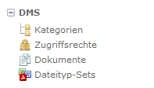
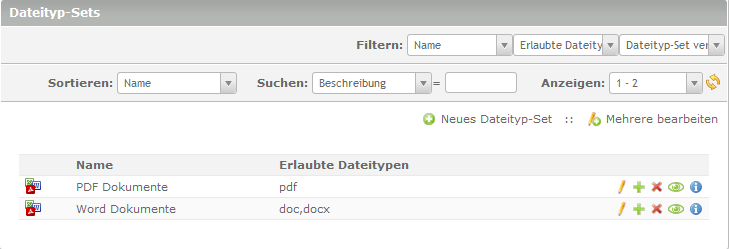

# Dateityp-Sets

Hier erhalten Sie Informationen über die Ansicht für Dateityp-Sets.

**Seiteninhalt**
<!-- toc -->
1. [Bezugsquelle](#bezugsquellen)
2. [Was sind Dateityp-Sets](#was-sind-dateityp-sets)
3. [Dateityp-Sets erstellen](#dateityp-sets-erstellen)
4. [Verarbeitung der Dateityp-Sets](#verarbeitung-der-dateityp-sets)

## Bezugsquellen

**Datatyp-Sets** ist ein extra Add-On des ContaoDMS und muss separat installiert werden. Sie können ContaoDMS auch als Bundle installieren. Darin ist das Add-On **Datatyp-Sets** dann schon enthalten:  

### Quelle Add-On:
**Github:** https://github.com/ContaoDMS/dms-FileTypeSets  
**Packagist:** https://packagist.org/packages/contao-dms/file-type-sets

### Quelle Contao-dms/bundle-all:

**Github:** https://github.com/ContaoDMS/bundle-all  
**Packagist:** https://packagist.org/packages/contao-dms/bundle-all

## Was sind Dateityp-Sets

* Dateityp-Sets enthalten erlaubte Dateitypen die in eine Kategorie abgelegt werden dürfen.
* Ein Set muss mindestens einen erlaubten Dateityp enthalten.
* Die Sets stehen dann bei Neuanlage von Kategorien bzw. Anpassung von bestehenden Kategorien zur Verfügung und können leicht ausgewählt werden.
* Dateityp-Sets vereinfachen die Zuweisung erlaubter Dateitypen die in eine Kategorie abgelegt werden dürfen erheblich.

## Dateityp-Sets erstellen

Im Modul DMS → Dateityp-Sets → dann auf „Neues Dateityp-Set“

* **Name:** Aussagekräftigen Namen vergeben (z.B. Word Dokumente)
* **Beschreibung:** optionale Angabe einer Beschreibung
* **Erlaubte Dateitypen:** doc, docx (Gross oder Kleinschreibung spielt keine Rolle)

*Sollen mehrere Dateitypen in einem Set enthalten sein, werden diese im Feld „Erlaubte Dateitypen“ durch Komma getrennt eingetragen. Z.B. pdf, zip oder jpg, gif, tif*

* **Dateityp-Sets veröffentlichen:** Checkbox aktivieren

Jetzt hat man ein Dateityp-Set vom Typ **doc,docx** angelegt.

Auf diese Weise können beliebig viele Sets angelegt werden.

## Verarbeitung der Dateityp-Sets

Informationen wie sie **Dateityp-Sets** weiterverarbeiten, z.B. über die Vererbung, erhalten sie im Kapitel [Kategorien](/manual/de/admin/views/categories.md) im Abschnitt **Kategorieeinstellungen** --> Erlaubte Dateitypen
