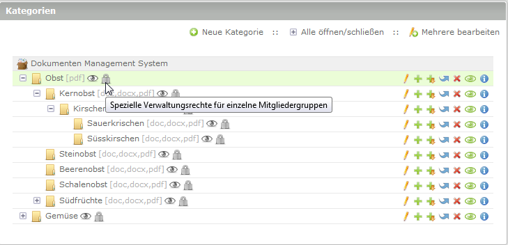

# Zugriffsrechte

Hier erhalten Sie Informationen über die Ansicht für Zugriffsrechte.

An dieser Stelle soll nochmal detailiert auf die Zugriffsrechte eingegangen werden.

Die Rechte sind in zwei Gruppen aufgeteilt:

**1. Grundsätzliches Leserecht** (für die in der Kategorie abgelegten Dokumente)
**2. Grundsätzliche Verwaltungsrechte** (für die in der Kategorie abgelegten Dokumente)

Wenn sie in der Kategorieübersicht mit dem Mauszeiger über die Symbole rechts neben einer Kategorie fahren, wird ihnen die aktuelle Rechteeinstellung angezeigt.

