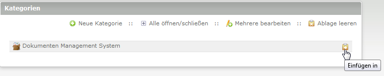
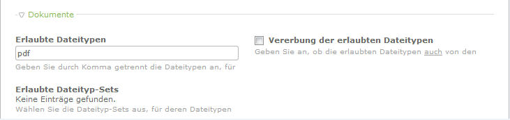
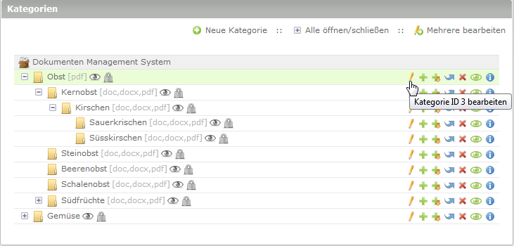
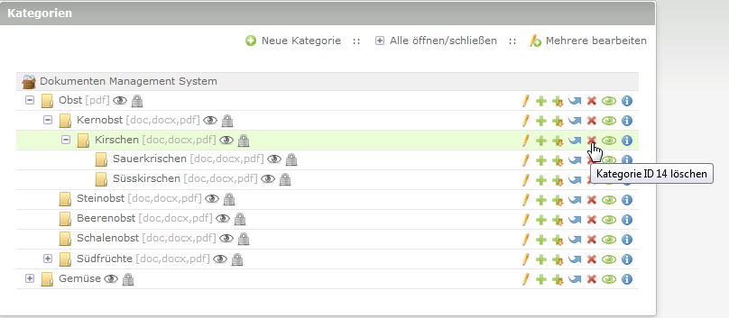

# Kategorien

Hier erhalten Sie Informationen über die Ansicht für Kategorien.

## Erstellen einer Kategorie

Im Modul DMS → Kategorien

auf „Neue Kategorie“ anlegen

* Kategorie mittels Einfügesysmbol an gewünschte Stelle einfügen.

**Folgende Abb.:** Anlage der allerersten Kategorie

## Nun erfolgen die Einstellungen.

### Name und Beschreibung

* **Name:** Kategorienamen eintragen (Pflichtfeld)
* **Beschreibung:** Beschreibung der Kategorie angeben (Angabe ist optional)

### Erlaubte Dateitypen

* **Erlaubte Dateitypen:** Geben Sie durch Komma getrennt die Dateitypen an, für die ein Upload gestattet ist. Die Liste wird beim Speichern automatisch sortiert und alle Dateitypen werden in Kleinbuchstaben konvertiert.

* **Vererbung der erlaubten Dateitypen:** Geben Sie an, ob die erlaubten Dateitypen auch
von den Oberkategorie(n) geerbt werden sollen. **Beispiel**: Sie haben eine Kategorie "Obst" und legen erlaubte Dateitypen fest. Dann sie eine neue Unterkategorie "Kernobst". Wenn sie nun für die Kategorie "Kernobst" das Häkchen bei *Vererbung der erlaubten Dateitypen* setzen, vererbt die Oberkategorie "Obst" die erlaubten Dateitypen an die Unterkategorie "Kernobst" weiter. Sie können für die Unterkategrie natürlich noch weitere erlaubte Dateitypen hinzufügen (entweder manuell oder über die Dateityp-Set Auswahl)

#### Wurden Dateityp-Sets angelegt stehen diese ebenfalls zur Auswahl.

* **Erlaubte Dateityp-Sets:** Häkchen setzen welche Dateitypen in dieser Kategorie erlaubt sind. Man kann das vorherige Feld *Erlaubte Dateitypen* frei lassen, wenn man nur mit Sets arbeiten möchte.

### Veröffentlichung von Dokumenten und Zugriffsrechte

* **Standardmäßige Veröffentlichung:** Geben Sie an, ob die in diese Kategorie hochgeladenen Dokumente standardmäßig veröffentlicht werden sollen.
* **Grundsätzliches Leserecht:** Alle Mitglieder haben uneingeschränktes Leserecht in dieser Kategorie. Sie müssen dazu nicht angemeldet sein.
* **Leserecht für angemeldete Mitglieder:**  Nur angemeldete Mitglieder haben uneingeschränktes Leserecht in dieser Kategorie.
* **Spezielle Leserechte für einzelne Mitgliedergruppen:** Es werden für diese Kategorie spezielle Leserechte für einzelne Mitgliedergruppen vergeben (im Bereich Zugriffsrechte).
* **Vererbung der Leserechte durch Oberkategorie(n):** Es werden für diese Kategorie die Leserechte der Oberkategorie(n) verwendet.

### Sonstige Einstellungen

* **Experten-Einstellungen:** Falls gewünscht kann hier eine ID und / oder Klasse(n) für CSS eintragen werden
* **Kategorie veröffentlichen:** Checkbox aktiv = Kategorie wird im Frontend angezeigt
* **Anzeigen ab** und **Anzeigen bis:** Von welchem Tag an soll die Kategorie angezeigt werden? Und bis zu welchem Tag soll die Kategorie angezeigt werden.
Lassen Sie die Felder leer um die Kategorie direkt und unbegrenzt anzuzeigen

Folgende Abb.: So könnte eine Kategorieübersicht aussehen

## Bearbeitung einer Kategorie

In der Kategorieübersicht klicken Sie auf das Stiftsymbol der entsprechenden Kategorie um zu den Einstellungen zu gelangen. (Siehe oben: *Nun erfolgen die Einstellungen für die Kategorie.*)

## Verschieben einer Kategorie

Kategorien lassen sich einfach über die Symbole *Verschieben* und *Einfügen* an eine andere Stelle verschieben

1. Kategorie verschieben: 

2. Kategorie einfügen:

## Löschen einer Kategorie

Das Löschen einer Kategorie ist nur dann erlaubt, wenn sich **kein** Dokument in dieser Kategorie oder in einer ihrer Unterkategorien befindet.

