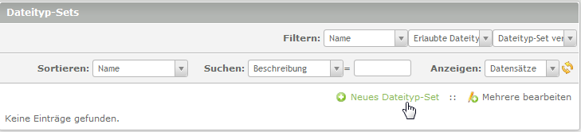

# Dateityp-Sets #

Hier erhalten Sie Informationen über die Ansicht für Dateityp-Sets.

*ist ein extra addon, muss separat installiert werden*

## Dateityp-Sets erstellen
Dateitypen-Sets erleichtern die Zuweisung erlaubter Dateitypen die in eine Kategorie abgelegt werden dürfen erheblich.

Im Modul DMS → Dateityp-Sets → dann auf „Neues Dateityp-Set“

* **Name:** Aussagekräftigen Namen vergeben (z.B. Word Dokumente)
* **Beschreibung:** optionale Angabe einer Beschreibung
* **Erlaubte Dateitypen:** doc, docx (Gross oder Kleinschreibung spielt keine Rolle)

*Sollen mehrere erlaubte Dateitypen in einem Set enthalten sein, werden diese im Feld „Erlaubte Dateitypen“ durch Komma getrennt eingetragen. Z.B. pdf, zip oder jpg, gif, tif*

* **Dateityp-Set veröffentlichen:** Checkbox aktivieren

Speichern nicht vergessen ;-)

Jetzt hat man ein Dateityp-Set vom Typ doc und docx angelegt.

Auf diese Weise können beliebig viele Sets angelegt werden.

## Verarbeitung der Dateityp Sets

* Vererbung
* Unifikation
* Anzeige
